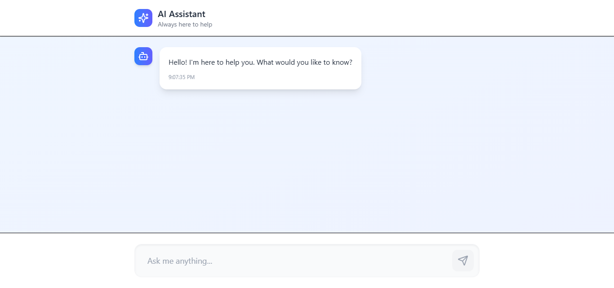

# Chat App with AI Integration

Welcome to the **Chat App** with AI integration! This application allows users to chat with an AI assistant, where the backend communicates with Google Generative AI for processing user messages and providing intelligent responses.

## Features

- **Interactive Chat Interface**: Users can send messages and get instant AI responses.
- **Generative AI Integration**: Powered by Google's Gemini model for high-quality and accurate responses.
- **Customizable UI**: Beautiful, responsive design with animation and a modern user interface.
- **Error Handling and Retry Mechanism**: Built-in retry logic in case of temporary AI service unavailability.

## Screenshots



## Tech Stack

- **Frontend**: React, Tailwind CSS, Lucide Icons
- **Backend**: Node.js, Express.js
- **AI Service**: Google Generative AI (Gemini Model)
- **State Management**: React hooks (useState, useEffect)
- **API Requests**: Axios
- **UI/UX**: Custom styling with Tailwind CSS for responsive design

## Installation

### Prerequisites

Before you begin, ensure you have the following installed:

- **Node.js** (version 16.x or later)
- **npm** (Node Package Manager)

### Steps to Run the Project Locally

1. **Clone the Repository**:

```bash
git clone https://github.com/your-username/chat-app.git
cd chat-app

```
2. **Install Dependencies**:

```bash
npm install
```

GEMINI_API_KEY=your-google-api-key-here


